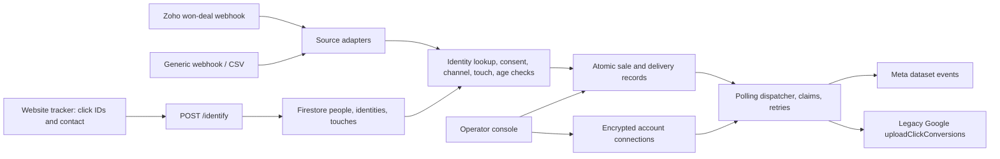

# Server-side conversion platform: repository audit and benchmark

> Historical assessment of the earlier implementation. Subsequent changes added Google Data Manager, service-account authentication, processing diagnostics, and queue/consent hardening. Use [the current staging readiness assessment](staging-readiness.md) for deployment decisions; the findings and test counts below describe the earlier snapshot.

Reviewed **9 October 2026 (India time)**. Scope: all seven application packages, tests, scripts, configuration, Firestore infrastructure, README, PLAN and SPEC. Dependencies and generated bundles were treated as dependencies/build output, not hand-written application code. This directory has no Git metadata, so findings describe the current files rather than a commit or historical change.

## Assessment

**This is a coherent CRM/offline-conversion prototype, with a useful website-to-store identity bridge. It is not yet a complete website-and-offline conversion platform or ready for production delivery.** Its strongest flow is: capture a website click, identify the visitor, receive a later won deal, match by phone/email, and queue one delivery per destination.

The highest-impact gaps are a retired Google API default, missing Data Manager API integration, incomplete consent withdrawal, no actual website conversion collection, incorrect Meta website event classification, and a single Google conversion action for every event type. Fix these before adding more connectors or selling broad conversion coverage.

All **188 existing tests pass** with Firestore emulation, along with TypeScript checking and both frontend builds. This validates the current local behavior. Platform requests in the tests are mocked; passing tests do not establish acceptance, attribution, match quality or bidding impact in live ad accounts.

This benchmark uses official platform requirements as the correctness baseline and documented implementations from Google sGTM, Stape, Segment and commercial Datahash as capability references. It does not claim a measured vendor ranking or advertise match-rate uplift without advertiser data.

## What actually exists



| Package | Actual responsibility | Assessment |
|---|---|---|
| `core` | Phone/email normalization and separate platform hashes; binary ad consent; destination-specific last eligible touch; age checks | Good separation; destination rules need current validation and richer consent |
| `tracker` | Reads landing click IDs; browser cookie/localStorage; contact form identification; consent hook | Small and useful for attribution bridging; has no `track()` conversion API, Pixel dispatch, Google tag integration or ecommerce event stream |
| `store` | Tenant-scoped Firestore people, identity merges, touches, sale outbox, delivery leases, connections and tenant settings | Transactions and tenant namespaces are useful; queue query, erasure, retention and lease ownership need work |
| `ingest` | Zoho won deals, generic JSON, CSV, sale pipeline and standalone Zoho sync/client | Suitable pilot sources; connectors cannot pass direct event attribution context; sync is not wired into the running service |
| `senders` | Meta event builder and HTTP transport; Google legacy upload and OAuth refresh; retry dispatcher | Working local skeleton; platform readiness incomplete |
| `server` | Identify, webhooks, admin API, health, static bundles, scheduler endpoint | One Node service; shared operator token; no user roles, abuse protection or OAuth authorization flow |
| `admin-ui` | Brands, account credentials, site snippets, mappings, CSV validation/import, sales, aggregate stats and resend | Useful operator console; connection/site-key existence is presented as setup completion without proving integration works |

The running system is a **custom Node/Firestore service**. Docker Compose can also start sGTM, but there are no exported GTM clients/tags/container configurations connecting it to this application. BigQuery, Cloud Tasks/Pub/Sub, Terraform, CDN provisioning, automatic CNAME/TLS, production deployment and per-user authentication described in PLAN/SPEC are not implemented here. PostgreSQL and Next.js in the draft spec are future architecture choices.

Preserve the useful parts: original touch timestamps, different Meta/Google phone hashes, pre-conversion touch selection, tenant namespaces, transaction-based identity merge, atomic sale/outbox creation, encrypted tokens, explicit skip reasons, HTTP timeouts and stable retry IDs.

## Current platform changes that affect this repo

1. **Google API v21 is retired.** The sender defaults to `v21`; the live server does not expose its version override through environment configuration. Google announced that v21 requests fail from **5 August 2026**. [Official sunset announcement](https://ads-developers.googleblog.com/2026/06/google-ads-api-v21-sunset-reminder.html)
2. **New offline/lead upload implementations need Data Manager API.** From 15 June 2026, legacy offline imports and enhanced-conversion-for-leads uploads are restricted; historical activity determined legacy allowlisting. There is no evidence in the repository that this project has that access. Implement Data Manager rather than assuming a version bump is sufficient. [Google offline import guidance](https://support.google.com/google-ads/answer/2998031)
3. **The optional developer token is not the main defect as of this review date.** Google's current guidance says tokens were sunset on **9 September 2026**, and access now follows the OAuth credentials' Google Cloud project. README's optional-token claim is therefore consistent with current guidance, although access approval still needs verification. [Google developer-token migration](https://developers.google.com/google-ads/api/docs/api-policy/developer-token)
4. **Website and offline measurement require explicit routes.** Google provides server-side Ads Conversion Tracking plus Conversion Linker and enhanced-conversion data in sGTM. Data Manager also supports offline conversions, Store Sales and additional data for tag conversions. Simply labelling a legacy offline upload `online` does not implement these website flows. [Google sGTM Ads setup](https://developers.google.com/tag-platform/tag-manager/server-side/ads-setup), [Data Manager use cases](https://developers.google.com/data-manager/api/devguides)
5. **Meta website events should describe website origin.** Meta's own SDK distinguishes `website`, `physical_store`, `phone_call`, `app` and other sources; its CAPI example includes source URL, browser identifiers and browser context. This repo classifies both `online` and `web_lead` as `system_generated`. [Meta action-source enum](https://github.com/facebook/facebook-python-business-sdk/blob/main/facebook_business/adobjects/serverside/action_source.py), [Meta CAPI example](https://github.com/facebook/facebook-python-business-sdk/blob/main/examples/AdsPixelEventsPostCustom.py)

Several Meta developer documentation pages could not be retrieved during this review. **Meta's 62-day offline acceptance assumption, exact WhatsApp requirements and the current suitability of Graph v21.0 remain unverified.** Do not read the Google v21 sunset finding as a claim that Meta v21.0 has the same lifecycle. Verify channel-specific limits and credentials with accessible current Meta documentation and controlled test events before release.

## Coverage across conversion types

“Partial” below means code exists for some necessary pieces, not a verified live integration. Default tenants enable store and WhatsApp channels; online and web leads must be explicitly enabled.

| Conversion/journey | Meta today | Google today | Work needed |
|---|---|---|---|
| Website click → identified enquiry → later store sale | Partial: physical-store Purchase with contact hashes and optional fbc | Partial legacy click/contact upload; retired default | Platform migration, withdrawal controls, live diagnostics |
| Walk-in POS purchase with consent, no captured click | Partial contact-only Meta Purchase | Partial lead/offline-style contact upload | Dedicated POS adapter, account eligibility, distinguish ordinary offline import from Google Store Sales |
| Website Lead / appointment / registration | Arbitrary name via generic webhook; no browser conversion collection; wrong web action source | Same single action regardless of name | Explicit successful-action trigger, shared event ID, per-event conversion configuration |
| Qualified lead → opportunity → won customer | No lead lifecycle connector/model | No separate stage/action mapping | Stable lead and stage identities, lifecycle adapters, rules per destination/action |
| Website paid purchase | Generic backend input possible; incomplete web context | Generic legacy upload possible | Ecommerce backend/webhook integration, website tag route, shared transaction ID |
| ViewContent, Search, AddToCart, checkout, payment-info funnel | No native collection or product payload | No website event/tag route | Event SDK/dataLayer mapping, catalog/cart details and event-specific consent |
| Shopify paid order, checkout extensions / Web Pixel | Not implemented | Not implemented | Signed Shopify ingestion, checkout capture and agreed ownership with installed apps |
| WooCommerce / Magento / other ecommerce | Only manually adapted generic input | Only manually adapted generic input | Native source adapters, signatures, cancellation/refund lifecycle |
| Click-to-WhatsApp → conversation → paid sale | Some ctwa field capture and messaging payload | No native messaging conversion path | Actual referral-webhook capture, message/lead identity, platform-specific account setup; map Google to a supported business outcome |
| Meta Instant Forms / Lead Ads → CRM stages | No Lead Ads webhook or native lead-ID schema | Not a Google conversion source by itself | Signed lead ingestion, platform lead ID, supported CRM feedback route |
| Phone call / call-centre outcome | No phone-call channel/context | No call-upload implementation | Call provider integration, call timing/identity and supported Google call or outcome route |
| Email / chat / system-generated outcomes | Channel enum cannot express them separately | Can only reuse one offline action | Separate event location from acquisition channel and destination route |
| App install / in-app purchase | No app data model | No app measurement integration | App SDK/MMP integration; separate platform requirements |
| Google Store Sales product | N/A; Meta physical-store reporting is a separate capability | Not implemented | Eligible account, Store Sales destination/action, store identity, value/items and current Data Manager payload |
| Google Store Visits / modelled visits | No automatic visit measurement | Not implemented by uploading a purchase | Treat as platform measurement/account setup, not a universal POS upload feature |
| Refund, return, cancellation, revenue correction | No defined correction policy | No adjustment/retraction route | Canonical order ledger and supported adjustments; do not assume a negative Purchase reverses prior reporting |
| Repeat purchase, subscription, renewal | Separate event IDs can be supplied manually | Same action and no subscription lifecycle | Distinct occurrence IDs and lifecycle integration |
| B2B / high-value long-delay sales | Generic events possible; age assumptions constrain them | Generic events possible; blanket 90-day rule | Event/action-specific windows, prompt lead-stage feedback, late-event diagnostics |
| Consent-denied or subsequently withdrawn customer | Initial ingestion gate exists; withdrawal incomplete | Same, without outbound Google consent fields | Durable withdrawal/suppression and destination-specific consent semantics |
| Cross-device identified customer | Deterministic phone/email match can work | Same | Preserve deterministic matching; do not promise recovery of anonymous cross-device clicks |

Google Store Sales is a distinct supported Data Manager use case; its arrival does not make every generic offline Purchase a Store Sales integration. [Google Store Sales announcement](https://ads-developers.googleblog.com/2026/05/data-manager-api-introducing-support.html)

The current product deliberately stores nothing server-side before phone/email identification. That limits early website funnel coverage. A broader website implementation needs an explicit policy for consented browser-only events: for example, transient event forwarding with minimal event context rather than creating an anonymous person record. This is an architectural scope decision, not something that an extra sender field alone resolves.

## Benchmark against established implementations

There is no single best system for all these journeys. Compare the components required for this product, and verify any vendor on the advertiser's own conversion actions and data.

| Reference | Documented capability relevant here | What this repo should learn from it |
|---|---|---|
| Google sGTM native Ads setup | Conversion Linker, event triggers, Ads conversion ID/label, transaction/value/currency, enhanced-conversion user data and preview validation | Add a real website measurement path and explicit conversion trigger/configuration. [Official guide](https://developers.google.com/tag-platform/tag-manager/server-side/ads-setup) |
| Meta CAPI Gateway via Stape | Configures a gateway around existing Meta website tracking, with dataset/account connection and custom-domain setup | Website event onboarding should be concrete and observable. This gateway requires existing web events; it alone is not a Google/offline platform. [Stape setup](https://stape.io/helpdesk/documentation/how-to-configure-meta-conversions-api-gateway), [Gateway scope](https://stape.io/price-gateway) |
| Segment Facebook CAPI Actions | Per-event mappings, event IDs, ecommerce contents and additional user/context fields; browser/server dedup guidance | Broader event schema and explicit destination mappings are missing here. [Segment implementation](https://www.twilio.com/docs/segment/connections/destinations/catalog/actions-facebook-conversions-api) |
| Commercial Datahash | Vendor advertises web/app/offline/CRM/WhatsApp Meta routes and Google web/leads/Store Sales/offline/Data Manager routes, with diverse sources | Closest coverage reference to the product described in PLAN. This repo implements a narrow subset; vendor wclaims are not an independently measured reliability or performance result. [Vendor connection catalog](https://www.datahash.com/connections/) |

The defensible differentiator here is **CRM-first website-to-store matching with a controllable tenant policy and visible delivery history**. Retain that while filling website measurement and current Google transport. A rewrite of Firestore or the console is not the first priority.

## Prioritized findings with code evidence

### Release blockers

**P0 — Google transport cannot be assumed to work in production.** `packages/senders/src/google.ts:5,118` defaults to a retired API and exclusively calls legacy `uploadClickConversions`. `packages/server/src/main.ts:50` passes no version override. Add Data Manager `events:ingest`, its OAuth scope and approved project/account access. Keep a legacy transport only when historical access is explicitly verified. Confirm conversion-action ownership, including cross-account manager-owned actions; today's settings assume customer and action owner are the same.

**P0 — Withdrawal does not suppress previously authorized data.** `tracker.ts:175` retains cookie data on denial and retains localStorage in opt-in mode. `server/src/identify.ts:71` returns 202 for denied consent before persisting a changed state. `ingest/src/pipeline.ts:58` snapshots consent at ingestion; `senders/src/dispatcher.ts:89` only rechecks age before sending. Consequently, a withdrawal can leave the stored person consent true and pending deliveries eligible to send. Add a durable withdrawal endpoint, complete browser cleanup, a consent event history and a dispatch-time suppression check. Handle deletion and withdrawal for CRM-only people too.

### Essential conversion correctness

**P1 — Website conversions are incomplete and misclassified.** `senders/src/meta.ts:11` maps web channels to `system_generated`; its event/user-data types omit event source URL, user agent, IP, fbp and external ID. The tracker does not collect fbp or fire conversion events. Use actual conversion context and source classification; retain physical-store classification for POS purchases. Never substitute the CRM server's IP for a shopper's browser IP. Changing the action source alone does not supply the missing website fields.

**P1 — Every Google event goes to one action.** `store/src/connections.ts:16` has one `conversionActionId`; `senders/src/google.ts:32` ignores `eventName`. The probe produces the same action for Lead and Purchase. Define mappings by event type, stage, channel and action owner. Specify which actions are primary for bidding so a lead and its later sale do not accidentally represent the same business value twice.

**P1 — Direct event click IDs and browser context are discarded.** `IncomingSale` and `mapGenericSale` accept contact fields but no gclid/braids/fbc/fbp/event URL/context. A CRM sale with its own captured GCLID cannot use it unless a matching person/touch already exists. Add event-owned attribution context and provenance to the canonical schema, adapters, persistence and senders. The eligibility unit test saying a click alone is sufficient is not reachable through the current generic webhook without extending that schema.

**P1 — Source-level idempotency is not canonical business-event deduplication.** `store/src/sales.ts:82` keys by source and event ID; CSV uses source `import`, Zoho uses `zoho`. The same purchase can create multiple local records across sources. Conversely, the same deal ID reused for separate stages is suppressed within one source; Meta/Google receive only the raw `eventId`, potentially colliding when unrelated sources reuse IDs. Introduce tenant-scoped canonical order/lead IDs plus occurrence/stage IDs and source aliases. Reuse the canonical ID across browser and server copies of the same event. Keep retries stable. Meta's SDK explicitly associates event ID with event name for browser/server identity. [Meta event implementation](https://github.com/facebook/facebook-python-business-sdk/blob/main/facebook_business/adobjects/serverside/event.py)

**P1 — Google consent and identity handling need current destination rules.** Outbound payloads contain no consent object. Binary internal `ads` cannot represent separate ad-user-data and personalization choices or consent provenance/version. Gmail normalization strips dots but retains plus suffixes, differing from the current upload guide. Braid-only events unconditionally omit contact identifiers under a `VERIFY` comment; revalidate this against the chosen transport rather than copying legacy restrictions. UTC timestamps with an explicit offset are valid; account timezone matching is a reporting convenience, not a universal upload requirement. [Google upload and normalization guidance](https://developers.google.com/google-ads/api/docs/conversions/upload-clicks)

**P1 — Queue can starve due deliveries.** `store/src/sales.ts:178` fetches at most 500 pending/retry/sending records, then filters retry/lease times in memory without ordering/pagination. The synthetic probe with 500 future retries followed by one pending record returns zero due deliveries. Query due timestamps in the database with suitable indexes and stable pagination, or use durable scheduled tasks. Add fairness across tenants and destinations.

**P1 — Pausing a tenant is not a universal dispatch gate.** `dispatchAll` skips suspended tenants, but admin `/dispatch` invokes `dispatchTenant` without checking status; admin import also permits a suspended tenant. In-flight dispatch checks no current channel/destination policy. Recheck tenant status and current suppression policy before every outbound request; reflect this in the console's claim that suspension stops sending.

**P1 — Acceptance and attribution are conflated.** `senders/src/google.ts:130` converts an unparsable successful response to `{}` and returns `sent`; the probe confirms a 200 `not-json` response becomes `uploaded`. Parse structured results and typed errors. Meta stores just `events_received`, discarding trace IDs/messages. Add transport accepted, processing, processed/rejected and attribution/reconciliation states. Data Manager diagnostics use request IDs and asynchronous per-destination results; processing can outlast HTTP acceptance. [Official diagnostics workflow](https://developers.google.com/data-manager/api/devguides/diagnostics)

### Reliability, privacy and operations

**P1 — Erasure is incomplete.** `store/src/store.ts:249` deletes one person's document, touches and pointing identities, but sale documents retain hashes for 400 days by default. Retired merged person records, sales, deliveries and logs need a defined deletion/suppression process. Hashing is useful data minimization but does not make linkable identity data anonymous.

**P1 — Payload redaction is narrower than the “no plain contact details stored” claim.** `server/src/webhook.ts:87` redacts mapped phone/email paths and stores the rest. The probe shows `customer.email` survives generic redaction. Zoho payloads may also include names, addresses or alternate contacts outside the mapped paths. Prefer allowlisted structured ingest logs; keep sensitive diagnostics out of routine logs.

**P1 — Operator and public endpoint hardening is absent.** Admin uses a single bearer token for every tenant. Public site keys and allowed Origin headers are not authentication against scripted forged identifies; identity poisoning can attach click IDs or merge records. Add per-user authorization, tenant permissions, audit logs, request/schema limits and rate limiting. Webhooks have a shared secret, but no source signatures/timestamps; secrets are also accepted in URLs. Keep tokens out of query strings and add signed source adapters where supported.

**P2 — Leases lack ownership/fencing.** Claims are transactional, but `completeDelivery` updates unconditionally with no claim token/version. If a worker pauses beyond the two-minute lease and another worker takes over, the old worker can overwrite the new result. Use a unique lease owner and conditional completion; renew leases if processing can exceed them. Transactional claims plus destination dedup are useful at-least-once mechanisms, not an exactly-once guarantee.

**P2 — Waiting for a connection increments attempts.** `claimDelivery` increments attempts before checking connection availability, while the disconnected branch leaves the counter intact. The existing test confirms waiting does not fail immediately, but never checks attempts. After reconnecting, a first transient transport failure can hit the exhausted attempt threshold. Track actual transport attempts separately from queue claims.

**P2 — Sequential work and weak failure isolation limit scaling.** Dispatcher processes each delivery sequentially; `dispatchAll` processes each tenant sequentially. One unhandled database failure can stop a run, and one slow tenant can delay others. Use bounded concurrency, batch by destination/account where supported, quotas, jitter and retry-after handling, circuit breakers and an inspectable dead-letter workflow. OAuth HTTP 429 is currently treated as an auth error rather than a temporary rate limit.

**P2 — Age/retention is hard-coded or inconsistently applied.** Meta 7/62 days and Google 90 days are defaults rather than action/transport-specific policy. Future events pass eligibility. Expired people can be returned until asynchronous TTL deletion; merged identities are not all refreshed on every identify. Store instances are cached indefinitely, and webhook-first initialization uses the default 90-day retention rather than tenant settings. Apply logical expiry, validated finite timestamps and current per-action windows; preserve original business times and explicitly mark synthetic noon values for date-only imports.

**P2 — Stored touch references can lose their attribution context.** Delivery stores person/touch IDs, not a delivery snapshot. Merging moves secondary touches; a queued sale pointing at the secondary can no longer retrieve that touch. Deletion/TTL can similarly remove it before retry. Resolve merge redirects consistently and choose a minimal, retention-governed delivery snapshot strategy.

**P2 — Browser storage is shared across site keys and can contain contact text.** `dh_touches`, `dh_t` and `dh_sent` are fixed keys. The probe shows a second configured site key on the same origin reads the first key's touches. `sentSignatures` serializes phone/email into sessionStorage. Namespace storage by tenant/site, avoid raw-contact dedup strings and clear all relevant state on withdrawal. Capture is called on load; SPA navigation needs integration. Re-reading the same landing click can change `clickedAt` and rebuild fbc, so preserve an existing click's original provenance instead of renewing it on reload.

**P2 — Metrics do not prove measurement quality.** Stats cap the sale query at 5,000 without exposing truncation, make a delivery query per sale, combine destination deliveries in click/contact counters, and call any person link a website link. Separate eligible business events from delivery attempts; expose completeness, acceptance, diagnostics, click coverage and reconciliation. Site-key creation is not evidence the script is installed, and connection save is not evidence credentials work.

**P2 — Sync, setup and deployment remain incomplete.** Zoho sync is a library without persisted cursor/scheduler/credentials in the running service. Firestore indexes are empty despite a collection-group tenant/status query. TTL policies are instructions rather than deployed infrastructure. The generated snippet omits tenant opt-out mode, so its browser defaults to opt-in even for opt-out tenants. Add explicit setup verification, index/TTL deployment, health/readiness, secrets rotation, validated API version configuration and CI.

## Reproducible local benchmark

Artifacts: `scripts/audit-benchmark.ts` and `docs/conversion-benchmark-results.json`. Run `node --import tsx scripts/audit-benchmark.ts`. All contacts, tokens, IDs and responses are synthetic; no ad-platform requests are made. CPU microbenchmarks warm up 1,000 iterations and report the median of seven rounds. Dispatcher benchmarks execute the real dispatcher against in-memory repositories and a fake HTTP transport with controlled delay.

Environment: Apple M5, macOS arm64, Node v24.18.0. Results are local observations, not production capacity or vendor performance claims.

| Check | Measured result |
|---|---|
| Unit suite | 123 passed, 65 emulator-dependent tests skipped |
| Full suite with Firestore emulator | **188 passed in 19 files**, 6.94 seconds total |
| TypeScript | Passed |
| Build | Passed; tracker approximately 4.5 KB, admin JS approximately 26.6 KB, minified and uncompressed |
| Four platform phone/email hashes | Approximately 118,538 contact sets/sec |
| Eligibility with 50 synthetic touches, including touch construction | Approximately 166,607 evaluations/sec |
| Both destination payload builders | Approximately 1,312,289 pairs/sec |
| Dispatch 50 deliveries, 5 ms simulated HTTP latency | 291 ms; 171.8 deliveries/sec |
| Dispatch 50 deliveries, 25 ms simulated HTTP latency | 1,320 ms; 37.9 deliveries/sec |
| Dispatch 50 deliveries, 100 ms simulated HTTP latency | 5,070 ms; 9.86 deliveries/sec |

Maximum observed concurrent outbound requests was **one** in every dispatcher scenario. The bottleneck is serialized network/database work rather than payload-building CPU. These dispatch rates exclude Firestore latency, real OAuth, network variability, quotas and platform processing. Database-backed test duration is not a database throughput benchmark.

At the default 50-delivery limit, a single scheduler invocation every minute considers at most 50 destination deliveries per tenant per invocation—about 25 sales if both destinations are due. That is a polling cap, not proof of sustainable throughput; overlap, run duration, failures and queue starvation can reduce it. Batch/concurrency changes should be validated against quotas and durable recovery, not just faster mock HTTP.

The first emulator run failed because the sandbox blocked connections; rerunning with localhost access passed the entire suite. No live credential validation, production load test, Meta EMQ measurement, attribution test or competitor load test was performed.

## Target architecture and implementation order

Use a single canonical business-event ledger with explicit routes, retaining the current tenant model and adapters:

```text
Website / ecommerce / POS / CRM / calls / messaging
  → validated event envelope + identity + consent provenance
  → canonical business-event deduplication
  → durable event ledger and destination outbox
  → current tenant/consent/suppression policy
  → destination + conversion-action mapping
  → Meta web / physical-store / messaging / supported CRM or app route
  → Google website tag route / Data Manager offline, leads, Store Sales or augmentation
  → processing diagnostics and source-to-platform reconciliation
```

Separate four concepts: acquisition channel, physical event location, business event type/stage, and platform transport. A WhatsApp-acquired customer who pays in a shop may have a physical-store Purchase; a webhook received by a server can still describe a website Purchase.

**First: make the existing pilot trustworthy.** Implement current Google transport and access checks; fix durable withdrawal and dispatch-time policy; correct Meta classification/schema; define canonical IDs and per-event Google actions; fix due querying; prevent false success and retain diagnostic IDs. Verify Meta offline/messaging limits. Add regression cases for each reproduced finding.

**Second: complete website + ecommerce coverage.** Add a consent-aware `track(event)` or explicit dataLayer integration; trigger conversion only on successful form/order/payment actions; preserve browser context and shared event/transaction IDs. Add Shopify paid/refund adapters and one defined Google website route. Ensure the existing Shopify apps and this product agree on event ownership and IDs before dual sending.

**Third: complete offline and lead lifecycle coverage.** Add POS imports with store IDs, qualified/converted lead mappings, direct CRM click context, signed Lead Ads/WhatsApp/call integrations as demanded by pilot customers, and scheduled Zoho catch-up with cursors. Treat Google Store Sales as a separate eligible integration. Implement order corrections and document destination-specific limitations. Google supports distinct correction concepts such as retraction and restatement; their current routing should be verified when implemented. [Google adjustment semantics](https://developers.google.com/google-ads/api/reference/rpc/v20/ConversionAdjustmentTypeEnum.ConversionAdjustmentType)

**Fourth: operationalize multi-brand service.** Add per-user roles, connection authorization/testing, queue quotas/concurrency, lease fencing, complete erasure, KMS/secret rotation, deployed indexes/TTL, infrastructure-as-code and meaningful alerts. Replace full-scan reporting with complete, incrementally maintained metrics or analytical export.

App measurement, audience activation/Customer Match and broad warehouse connectors can follow demand. Customer Match is an audience capability, not a fallback conversion upload method. GA4 ingestion and Google Ads conversion delivery also need explicit configuration; one does not automatically establish the other.

## Acceptance criteria for a real pilot

These are proposed engineering criteria, not measured results or guaranteed platform match rates.

| Dimension | Pilot acceptance check |
|---|---|
| Correctness | Distinct Lead, qualified Lead and Purchase map to intended actions; website/store/messaging origin is accurate; actual event time/value/currency preserved |
| Source completeness | Every eligible authoritative paid order has one canonical ledger event; rejected/skipped records have reasons; refund/cancel events reconcile |
| Deduplication | Retries, duplicate webhooks, CSV + CRM copies, browser + server copies and connector overlaps are tested; distinct stages/renewals remain distinct |
| Consent | Denial/withdrawal suppresses pending sends; browser state is cleared; dispatch policy uses current consent; audit provenance retained under the chosen policy |
| Delivery | Track acceptance separately from processing/rejection; retain request IDs; permanent failures are visible; temporary failures replay within allowed windows |
| Latency | Choose a pilot SLO such as p95 under five minutes from durable ingestion to transport acceptance under agreed load; measure platform processing separately |
| Reliability | Worker crash after claim, after HTTP acceptance and before completion; expired lease takeover; delayed reconnect; database outage; retry storm |
| Queue fairness | More than 500 deferred records cannot hide due work; one tenant/destination's outage cannot halt others |
| Identity | Valid platform hashes; conflicting phone/email, shared household contacts, merges and late identification tested; no speculative identity links |
| Platform reconciliation | Compare source orders, eligible events, API-accepted/processed records and platform diagnostics on aligned dates; do not equate ad-attributed counts with all sales |
| Privacy and isolation | Tenant permissions and cross-tenant negative tests; allowlisted logs; erasure covers sale hashes/merges; logical expiry does not rely only on TTL timing |
| Capacity | Load-test with realistic Firestore/network latency and agreed burst volume; measure backlog age, p95/p99 latency, error rate, resource use and database operations |

Live comparison against an existing integration should use a secondary/non-bidding conversion action or a controlled shadow setup. Use the same consented orders, timestamps, values and attribution windows. Compare completeness, duplicate rate, rejection reasons, diagnostics, operator effort and cost per processed eligible event. Do not dual-publish the same business outcome to primary actions without a verified deduplication design.

The useful next milestone is a verified **website enquiry → store purchase** flow plus a verified **website paid purchase** flow, each with current Google delivery, accurate Meta context, consent withdrawal, shared IDs and reconciliation. That provides a credible base for expanding into the rest of the coverage matrix.
